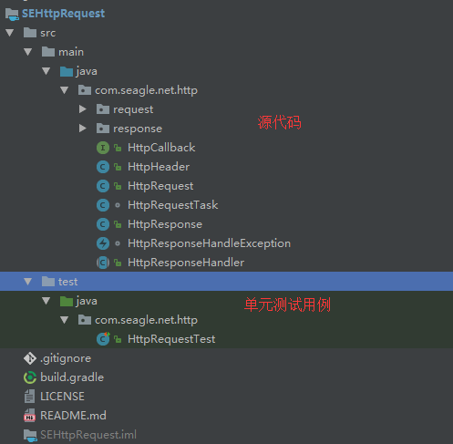

<a href='https://gitee.com/SilentEagle/SEHttpRequest'></img></a>
HTML
Markdown
Image
<a href='https://gitee.com/SilentEagle/SEHttpRequest'></img></a>
HTML
Markdown
Image
<a href='https://gitee.com/SilentEagle/SEHttpRequest'></img></a>

# SEHttpRequest
简单封装了一下HttpUrlConnection，纯Java语言实现，基于AndroidStudio Gradle 构建，
可用于Java项目和Android项目。体积小巧，实现简单，能够胜任一般简单的HTTP请求开发需求。

### 功能：

1.文件上传。

2.文件下载。

3.表单提交。

4.Multiple表单提交。

5.支持同步请求和异步请求。

### 工程目录结构

本工程是基于Android Studio Gradle构建的一个单独的Module，需要导入到具体的工程中运行。



### 使用说明

#### 工作流程


#### 请求方法

-  doGet 提交同步请求
-  doPost 提交POST请求

#### 同步请求
同步请求，只需要在提交请求的时候将callback设置为空（也可以不为空），然后通过HttpRequest#getResponse
方法就可以获得服务器的响应。同步请求会阻塞调用线程。

示例：

```
HttpRequest httpRequest = new HttpRequest("http://ip.taobao.com/service/getIpInfo.php?ip=210.21.220.218", );
httpRequest.getHeader().setHeader("Content-Type","text/plain");
HttpResponse response = httpRequest.doGet(null, null).getResponse();
int code = response.getCode();
String message = response.getMessage();
HttpHeader header = response.getHeader();
....
```

#### 异步请求
同步请求，只需要在提交请求的时候设置好HttpCallback,请求的HttpResponse就会在回调中返回到调用方。注意：回调接口运行在异步线程中。

示例：
```
HttpRequest httpRequest = new HttpRequest("http://ip.taobao.com/service/getIpInfo.php?ip=210.21.220.218", );
httpRequest.getHeader().setHeader("Content-Type","text/plain");
httpRequest.doGet(null, new HttpCallback() {
   @Override
    public void onRequestComplete(HttpRequest httpRequest, HttpResponse httpResponse) {
         int code = httpResponse.getCode();
         String message = httpResponse.getMessage();
         HttpHeader header = httpResponse.getHeader();
     }
});
```


#### 参数配置
- HttpRequest#setConnectTimeout(int time,TimeUnit unit)  设置连接超时时间。
- HttpRequest#setReadTimeout(int time,TimeUnit unit)  设置响应数据超时时间。

#### 请求头配置
调用HttpRequest#getHeader()就可以获取到请求的头部对象，调用HttpHeader#setHeader(key,value)来配置调用方希望配置的参数。

例如：
```
HttpRequest httpRequest = new HttpRequest("http://ip.taobao.com/service/getIpInfo.php?ip=210.21.220.218", );
httpRequest.getHeader().setHeader("Content-Type","text/plain");
```
#### 线程配置
如果在提交HTTP请求的时候，第一个参数是线程池，如果客户端希望使用自定义的线程池来驱动请求任务，
可以传入这个参数，否则系统使用默认线程池。

示例:
```
ExecutorService mExecutor = Executors.newSingleThreadExecutor();
httpRequest.doGet(mExecutor, null);
```

#### 请求响应
HttpResponse代表Http请求的响应封装。可以从HttpResponse中获取到响应的响应码，响应消息，以及响应的body对象。
body对象是构建HttpRequest时设置的HttpResponseHandler处理之后返回的，需要调用方强制转型。
-  如果handler为空，body的实际类型是InputStream对象，上层在使用完毕这个输入流以后需要手动关闭。
-  已经提供了两套handler:
    -  HttpFileDownloadResponseHandler:body实际对象类型是File。
    -  HttpTextResponseHandler：body的实际对象类型是String.
-  调用方可以自定义HttpResponse处理类。

#### 表单请求
系统提供HttpFormRequest请求，用来处理简单的表单键值对方式的HTTP请求，
调用方可以方便的使用HttpFormRequest#addParam来增加请求参数。

#### 文件上传
系统提供了HttpMultipleRequest来处理文件上传以及文件参数混合提交的请求。
调用方使用:
- HttpMultipleRequest#addParam(String,String) 添加普通参数
- HttpMultipleRequest#addParam(String,File) 添加文件参数
#### 文件下载
文件下载可以使用HttpFileDownloadResponseHandler就可以从HttpResponse#getBody得到下载的文件。


### 联系方式
- Email： yuanxiudong66@sina.com
- QQ：858686471